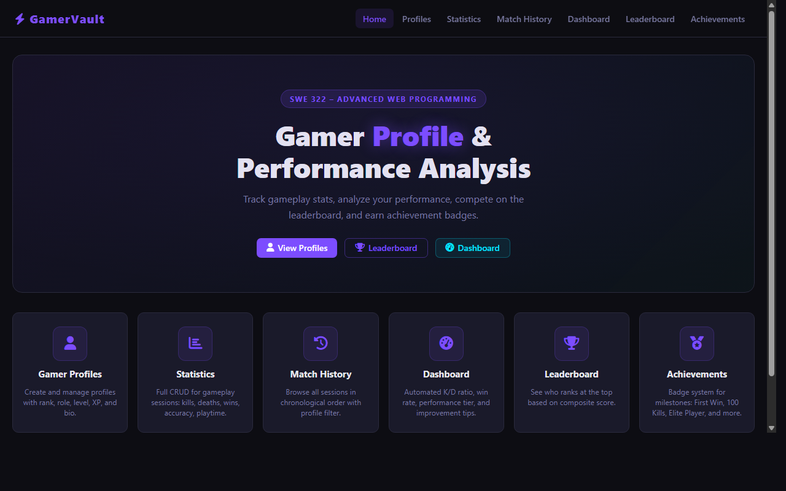
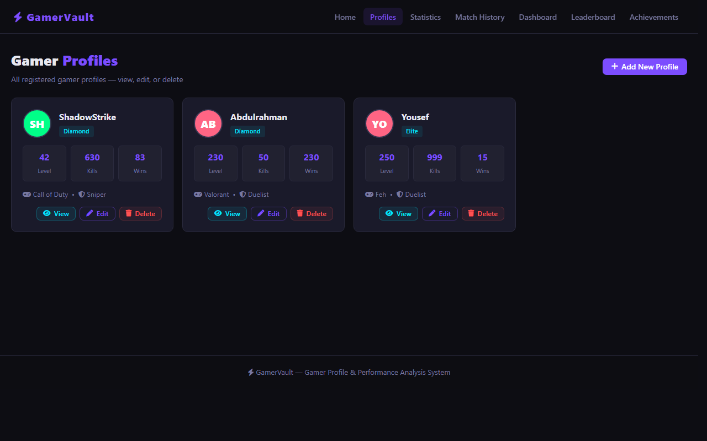
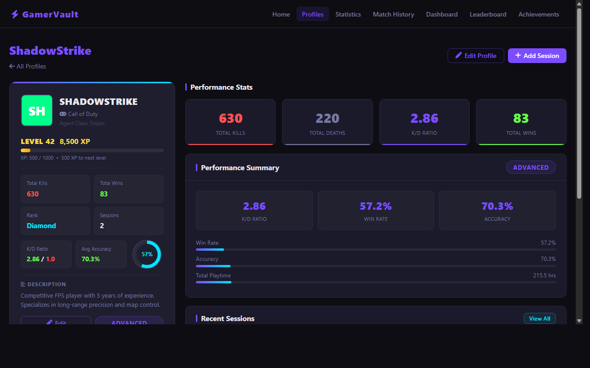
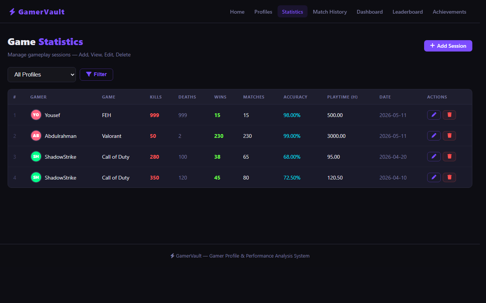
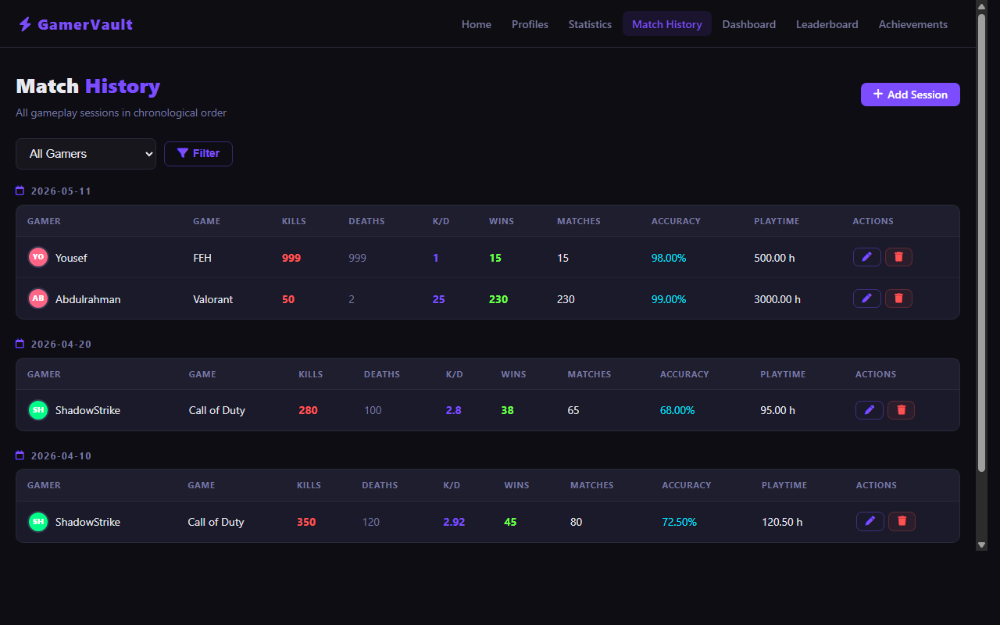
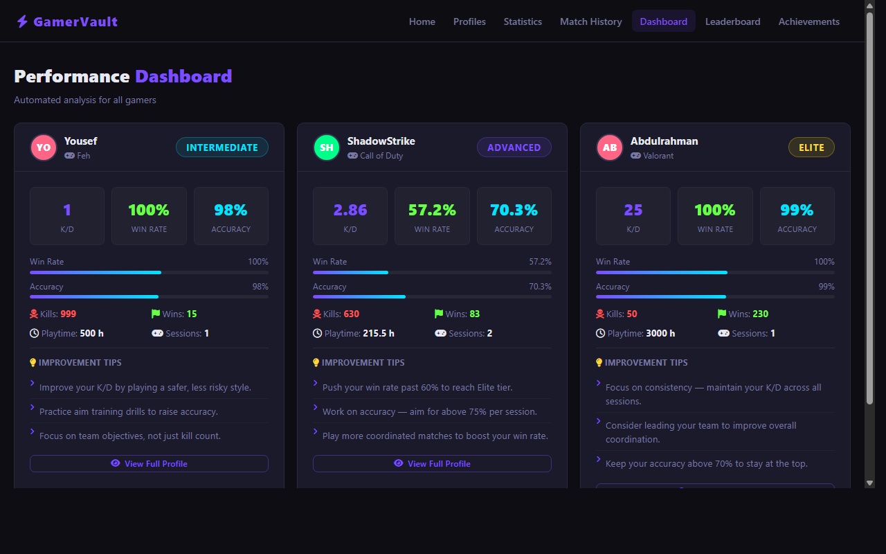
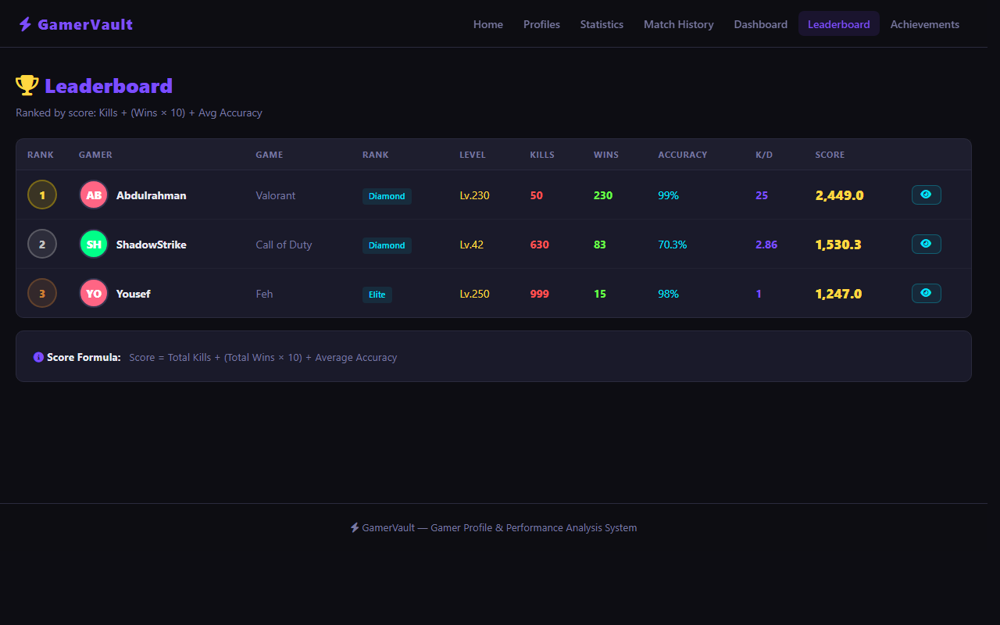
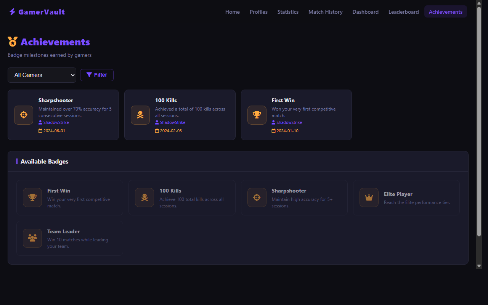

<p align="center">
  
</p>

<h1 align="center">⚡ GamerVault</h1>

<p align="center">
  <strong>A dark-themed Gamer Profile & Performance Analysis System built for SWE 322 – Advanced Web Programming.</strong><br/>
  Manage gamer profiles, track gameplay sessions, analyze performance, compete on a leaderboard, and earn achievement badges.
</p>

<p align="center">
  
  
  
  
  
  
  
</p>

---

## 🎮 About

GamerVault is a full-stack web application developed as a final project for **SWE 322 – Advanced Web Programming** at university. The system allows users to:

- Create and manage **gamer profiles** with rank, role, level, XP, and bio
- Log **gameplay sessions** with kills, deaths, wins, accuracy, and playtime
- Automatically calculate **K/D ratio**, win rate, and performance tier
- View a **performance dashboard** with improvement tips per gamer
- Compete on a **leaderboard** ranked by composite score
- Earn and view **achievement badges** (First Win, 100 Kills, Sharpshooter, Elite Player, Team Leader)

Built entirely with **plain PHP, vanilla CSS, and vanilla JavaScript** — no frameworks.

---

## ✨ Features

- 👤 **Gamer Profiles** — Full CRUD: create, view, edit, and delete profiles with avatar initials and color
- 📊 **Game Statistics** — Log and manage gameplay sessions per profile with profile filter
- 🕐 **Match History** — Sessions grouped by date with calculated K/D ratio per row
- 🧠 **Performance Dashboard** — Auto-calculated tier badges (Elite / Advanced / Intermediate / Beginner) with personalized improvement tips
- 🏆 **Leaderboard** — Ranked by score formula: `Kills + (Wins × 10) + Avg Accuracy`, with gold/silver/bronze medals
- 🥇 **Achievements** — Badge system with Font Awesome icons, earned badges per gamer, and full badge legend
- 🔍 **Profile Detail** — Dark gaming card layout with XP progress bar, circular win-rate indicator, stat cards, and session history
- 🔒 **Security** — All DB writes use prepared statements (`bind_param`), all output escaped with `htmlspecialchars()`
- ⚡ **Animations** — XP and performance bars animate from 0% to real value on page load via JavaScript

---

## 🖼️ Screenshots

| Home Page | Gamer Profiles |
|:---------:|:--------------:|
|  |  |

| Profile Detail | Game Statistics |
|:--------------:|:---------------:|
|  |  |

| Match History | Performance Dashboard |
|:-------------:|:---------------------:|
|  |  |

| Leaderboard | Achievements |
|:-----------:|:------------:|
|  |  |

---

## 🚀 Getting Started

### Prerequisites

- [XAMPP](https://www.apachefriends.org/) (Apache + MySQL)
- A web browser

### Installation

```bash
# 1. Clone the repository into your XAMPP htdocs folder
git clone https://github.com/AbdulrahmanAlaasi/gamer-profile.git
cd gamer-profile
```

```bash
# 2. Import the database (MySQL CLI)
mysql -u root -p < database/gamer_profile_db.sql
```

Or import via **phpMyAdmin**:
1. Open `http://localhost/phpmyadmin`
2. Create a new database named `gamer_profile_db`
3. Import `database/gamer_profile_db.sql`

```bash
# 3. Start Apache and MySQL in XAMPP, then open:
http://localhost/gamer_profile/
```

---

## ⚙️ Configuration

Edit `config.php` to match your database settings:

```php
define('DB_HOST', 'localhost');
define('DB_USER', 'root');
define('DB_PASS', '');           // Default XAMPP password (empty)
define('DB_NAME', 'gamer_profile_db');
```

---

## 🗂️ Project Structure

```
gamer_profile/
├── index.php               # Home / landing page
├── profiles.php            # Gamer profiles list (CRUD)
├── profile_add.php         # Add new profile
├── profile_edit.php        # Edit existing profile
├── profile_detail.php      # Full profile view with stats
├── profile_delete.php      # Delete profile handler
├── statistics.php          # Game sessions table (CRUD)
├── stat_add.php            # Add new session
├── stat_edit.php           # Edit existing session
├── stat_delete.php         # Delete session handler
├── match_history.php       # Sessions grouped by date
├── dashboard.php           # Performance analysis dashboard
├── leaderboard.php         # Ranked leaderboard
├── achievements.php        # Earned badges + badge legend
├── config.php              # DB connection + helper functions
├── css/
│   └── style.css           # Dark gaming theme (CSS variables)
├── js/
│   └── main.js             # Animations, confirmations, alerts
├── includes/
│   ├── header.php          # Shared nav + head
│   └── footer.php          # Shared footer + scripts
├── database/
│   └── gamer_profile_db.sql  # Schema + sample data
└── screenshots/            # Page screenshots
```

---

## 🗄️ Database Schema

Three tables with foreign key constraints:

| Table | Key Columns |
|:------|:------------|
| `profiles` | `id`, `gamer_name`, `favorite_game`, `gamer_rank`, `preferred_role`, `bio`, `level`, `xp` |
| `statistics` | `id`, `profile_id` (FK), `game_title`, `kills`, `deaths`, `wins`, `matches_played`, `accuracy`, `playtime`, `session_date` |
| `achievements` | `id`, `profile_id` (FK), `badge_name`, `description`, `unlocked_at` |

> Both `statistics.profile_id` and `achievements.profile_id` use `ON DELETE CASCADE` — deleting a profile automatically removes all its sessions and badges.

---

## 📦 Tech Stack

| Technology | Purpose |
|:-----------|:--------|
| **PHP 8** | Server-side logic, CRUD, performance tier calculation |
| **MySQL** | Relational database with foreign keys |
| **HTML5** | Semantic page structure |
| **CSS3** | Dark gaming theme, CSS variables, Grid, Flexbox, conic-gradient |
| **JavaScript (ES6)** | Bar animations, delete confirmations, alert auto-dismiss |
| **Font Awesome 6** | Icon library via CDN |
| **XAMPP** | Local Apache + MySQL development server |

---

## 🧮 Score & Tier Formulas

**Leaderboard Score:**
```
Score = Total Kills + (Total Wins × 10) + Average Accuracy
```

**Performance Tier:**
| Tier | Condition |
|:-----|:----------|
| 🟣 Elite | K/D ≥ 2.0 AND Win Rate ≥ 60% |
| 🔵 Advanced | K/D ≥ 1.5 AND Win Rate ≥ 45% |
| 🟡 Intermediate | K/D ≥ 1.0 |
| ⚪ Beginner | Below all thresholds |

---

## 👥 Team

| # | Name | Student ID |
|:-:|:-----|:----------:|
| 1 | Yousef Albatniji | 202211156 |
| 2 | Abdulrahman Alaasi | 202211177 |
| 3 | Meshari Almana | 202221002 |
| 4 | Yaser Braik | 202311081 |

**Course:** SWE 322 – Advanced Web Programming

---

<p align="center">
  Made with ❤️ using PHP & MySQL
</p>
